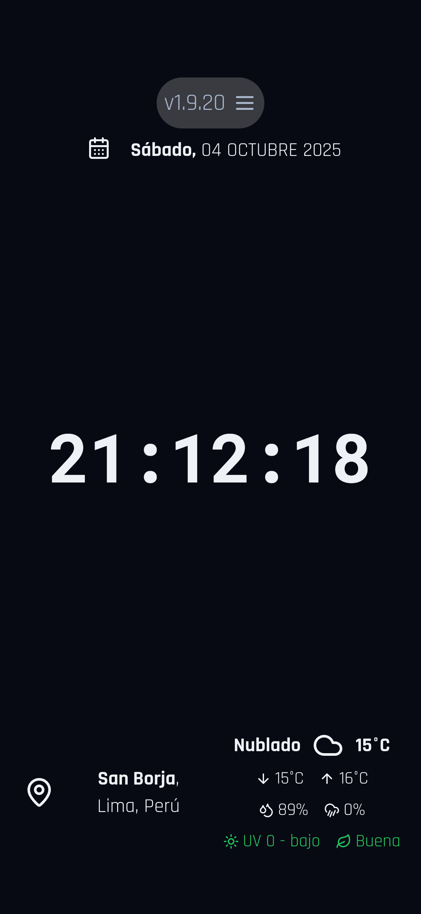
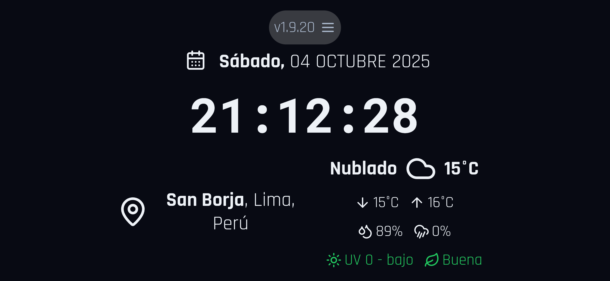
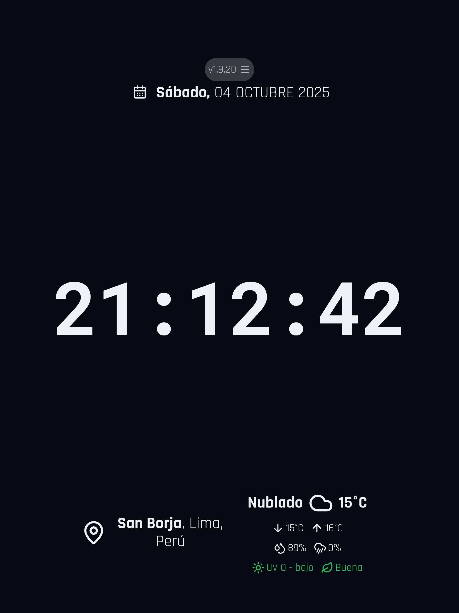
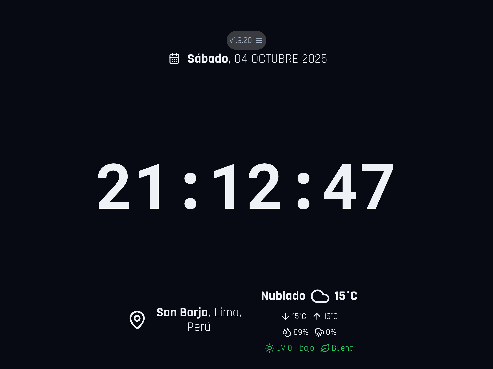
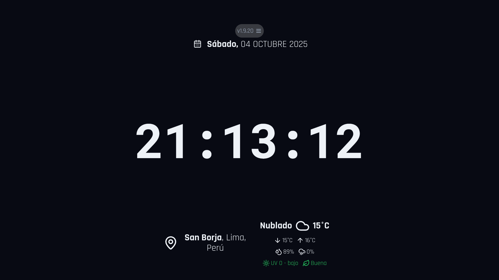

# Dashboard web: Time, Date, Location and Weather

[](https://github.com/diegoiprg/dilware-myself-frontend-web-fecha-hora-clima/actions/workflows/deploy-gh-pages.yml)
[](https://github.com/diegoiprg/dilware-myself-frontend-web-fecha-hora-clima/actions)
[](https://www.gnu.org/licenses/gpl-3.0)
[](./package.json)
[](https://nodejs.org/)
[](https://nextjs.org/)
[](https://www.typescriptlang.org/)
[](https://tailwindcss.com/)
[](https://github.com/diegoiprg/dilware-myself-frontend-web-fecha-hora-clima)
[](https://github.com/diegoiprg/dilware-myself-frontend-web-fecha-hora-clima)
[](https://github.com/diegoiprg/dilware-myself-frontend-web-fecha-hora-clima)
[](https://github.com/diegoiprg/dilware-myself-frontend-web-fecha-hora-clima/issues)
[](https://github.com/diegoiprg/dilware-myself-frontend-web-fecha-hora-clima/pulls)

Minimalist and full-screen web application developed with a vibecoding approach (AI + human guidance). Displays real-time date, time, location, and local weather, ideal for giving a second life to tablets or old devices as connected clocks, dashboards, or interactive backgrounds. Built with pure HTML, CSS, and JavaScript, without frameworks or external dependencies, prioritizing performance, stability, and cross-platform compatibility. Although it works correctly in most modern browsers, it is especially optimized for the Apple ecosystem (iOS, iPadOS, and macOS), with a smooth experience in Safari and WebKit thanks to its adapted rendering and efficient resource management. Experimental project to explore how AI can accelerate development without losing human control or technical quality, improving abstraction, design, and communication skills during the process.

[**Live Demo**](https://diegoiprg.github.io/dilware-myself-frontend-web-fecha-hora-clima/)

## Key Features

- **Real-time Clock**: Displays the current time with a customizable 12/24-hour format and an option to show/hide seconds.
- **Date Display**: Shows the current day of the week, month, and day.
- **Geolocation**: Automatically detects and displays the user's city and country.
- **Live Weather**: Provides real-time weather information, including temperature and a descriptive icon for the current conditions.
- **Fullscreen Mode**: Click on the time to enter an immersive, distraction-free fullscreen view with automatic screen wake lock to prevent sleep.
- **Screen Wake Lock**: Keeps the screen awake during fullscreen mode (compatibility varies by device and OS).
- **Customizable Settings**: A settings panel allows users to toggle features like the clock format and seconds display.
- **Responsive Design**: The layout adapts gracefully to different screen sizes, from mobile devices to large desktop monitors.
- **Analytics & User Insights**: Comprehensive Google Analytics 4 integration tracks user interactions, environment data (browser, OS, device), and app usage patterns for continuous improvement.
- **Automatic Update Notifications**: Smart version checking with visual indicators and notifications when new app versions are available, ensuring users stay up-to-date with the latest features.

## Usage

### Getting Started

1. **Load the Application**: Open your web browser and navigate to the dashboard URL
2. **Automatic Setup**: The application will automatically detect your location and display current weather information
3. **Optional Fullscreen**: Click on the displayed clock to enter fullscreen mode for an immersive experience with automatic screen wake lock
4. **Access Settings**: Click the settings icon (⚙️) in the top-right corner to customize the application

### Interface Overview

- **Clock Display**: Large, prominent time display in the center
- **Date Information**: Current date shown above or beside the clock
- **Location & Weather**: Real-time weather data with temperature, conditions, and additional metrics
- **Settings Panel**: Accessible via the gear icon for personalization options

### Fullscreen Mode & Screen Wake Lock

When entering fullscreen mode, the application automatically attempts to prevent screen sleep using the Screen Wake Lock API:

**✅ Compatible Devices:**

- Android tablets with Android 6.0+ (tested and working)
- Most modern desktop browsers
- Modern Android smartphones

**❌ Incompatible Devices:**

- iPhone/iOS devices (iOS restrictions prevent wake lock functionality)
- Android tablets with Android 4.x (screen may still lock, unless device is configured to stay awake while charging)

**Note**: Screen wake lock compatibility depends on device OS version and browser implementation. The feature gracefully fails on unsupported devices without affecting other functionality.

### Recommended Usage

- **Continuous Display**: Ideal for tablets, secondary monitors, or digital signage
- **Personal Dashboard**: Perfect for home office setups or personal information displays
- **Device Integration**: Works well on tablets repurposed as smart displays

## Screenshots

### iPhone (Portrait)



### iPhone (Landscape)



### iPad (Portrait)



### iPad (Landscape)



### macOS (Desktop)



_Note: Screenshots show the application running with sample data. The interface adapts responsively across different devices and orientations._

## Technologies Used

This project is built with a modern web stack:

- **Framework**: [Next.js](https://nextjs.org/) (with App Router)
- **Language**: [TypeScript](https://www.typescriptlang.org/)
- **Styling**: [Tailwind CSS](https://tailwindcss.com/)
- **UI Components**: [shadcn/ui](https://ui.shadcn.com/)
- **AI/Backend**: [Google's Genkit](https://firebase.google.com/docs/genkit) for potential backend and AI-powered features.
- **Deployment**: [GitHub Pages](https://pages.github.com/) via [GitHub Actions](https://github.com/features/actions).

## Dependencies

This application relies on the following external services and permissions:

- **APIs**:

  - [WeatherAPI.com](https://www.weatherapi.com/) for primary weather data (higher accuracy, rain probability, air quality)
  - [Open-Meteo API](https://open-meteo.com/) for weather data fallback (free, unlimited)
  - [IP-API](https://ipapi.co/) for IP-based location fallback
  - [BigDataCloud API](https://www.bigdatacloud.com/) for reverse geocoding

- **Permissions**:

  - Location permissions (Geolocation API) for accurate positioning

- **Minimum System Requirements**:
  - **Operating Systems**: iOS 12+, iPadOS 13+, macOS 10.14+, Android 4.4+ (with limitations)
  - **Browsers**: Safari 12+, Chrome 81+ (with limitations), Firefox 65+, Edge 79+

## Technical Limitations

While the application can run on older devices such as Android 4.4 and Chrome 81, there are some limitations:

- **Weather Data**: The weather section may not function properly on older Android versions and Chrome browsers.
- **Location Accuracy**: Location detection is less precise on older devices and browsers.

## Testing

The application has been tested on the following devices and configurations (vertical and horizontal modes):

- iPad Pro 12.9" M1 with iPadOS 26 and Safari browser
- iPhone 15 Pro Max with iOS 26 and Safari browser
- Mac Mini M1 with macOS 26 and Safari browser
- Samsung GT-P3110 tablet with Android 6.0.1 and Chrome v106.0.5249.126
- Samsung SM-T113NU tablet with Android 4.4.4 and Chrome v81.0.4044.138

## Getting Started

To run the project locally, follow these steps:

1.  **Clone the repository:**

    ```bash
    git clone https://github.com/diegoiprg/dilware-myself-frontend-web-fecha-hora-clima.git
    cd dilware-myself-frontend-web-fecha-hora-clima
    ```

2.  **Install dependencies:**

    ```bash
    npm install
    ```

3.  **Run the development server:**

    ```bash
    npm run dev
    ```

    Open [http://localhost:9002](http://localhost:9002) with your browser to see the result.

## Configuration

The application includes a settings panel (accessible via the gear icon in the top-right corner) where users can customize:

- **Temperature Unit**: Choose between Celsius (°C) or Fahrenheit (°F)
- **Time Format**: Select 12-hour or 24-hour clock format
- **Seconds Display**: Toggle visibility of seconds in the clock
- **Refresh Interval**: Set how often weather and location data should be updated (5-30 minutes or never)

Settings are automatically saved to your browser's local storage.

### Environment Variables

Create a `.env.local` file in the project root for custom API endpoints:

```env
# WeatherAPI.com (Primary - Higher accuracy, rain probability, air quality)
NEXT_PUBLIC_WEATHERAPI_KEY=your_weatherapi_key_here

# Open-Meteo (Fallback - Free, unlimited)
NEXT_PUBLIC_WEATHER_API_BASE=https://api.open-meteo.com/v1/forecast
```

**WeatherAPI.com Setup:**

1. Sign up at [weatherapi.com](https://www.weatherapi.com/)
2. Get your free API key (1000 calls/day)
3. Add it to your `.env.local` file
4. The app will automatically use WeatherAPI.com when available, falling back to Open-Meteo when quota is exceeded

## Data Sources

- **Weather Data**: [WeatherAPI.com](https://www.weatherapi.com/) (Primary) - High-accuracy weather API with rain probability, air quality index, and detailed forecasts (1000 free calls/day). Falls back to [Open-Meteo API](https://open-meteo.com/) (unlimited free tier) when quota exceeded
- **Geolocation**: Browser Geolocation API with fallback to IP-based location via [IP-API](https://ipapi.co/)
- **Reverse Geocoding**: [BigDataCloud API](https://www.bigdatacloud.com/) for converting coordinates to human-readable addresses

## Analytics & User Tracking

The application includes comprehensive Google Analytics 4 integration to track user behavior and environment data:

### Accessing User Device Information

To view detailed technical information about your users' devices and environment, follow these steps:

1. **Access Google Analytics 4**:

   - Go to [analytics.google.com](https://analytics.google.com)
   - Select your GA4 property (ID: G-FF81FMV5GT)

2. **Navigate to Reports**:

   - Click on "Reports" in the left sidebar
   - Go to "Tech" section → "Tech details"

3. **View Device & Environment Data**:

   - **Device Category**: Mobile, Tablet, Desktop usage breakdown
   - **Operating System**: iOS, Android, macOS, Windows, Linux distribution
   - **Browser**: Safari, Chrome, Firefox, Edge usage statistics
   - **Screen Resolution**: Most common screen sizes and pixel ratios
   - **Language**: User language preferences
   - **Country/Region**: Geographic distribution of users

4. **Custom Dimensions & Events**:

   - **Custom Events**: Track fullscreen toggles, settings changes, theme switches
   - **User Environment**: Browser version, OS version, device type, touch support
   - **App Usage**: Orientation changes, version updates, feature interactions
   - **Error Monitoring**: JavaScript errors with context and stack traces

5. **Real-time Monitoring**:

   - Go to "Reports" → "Realtime" to see live user activity
   - Monitor active users, page views, and real-time events
   - View current user locations and device types

6. **Advanced Analysis**:
   - Create custom reports combining device data with user behavior
   - Set up alerts for specific device categories or error rates
   - Use audience segmentation based on device characteristics

### Tracked Data

- **User Interactions**: Fullscreen toggles, settings changes, temperature unit changes, time format preferences
- **App Usage**: Orientation changes, device type detection, app version tracking, update notifications
- **Weather & Location**: Data loading success/failure, geolocation permissions, location accuracy
- **User Environment**: Browser name/version, operating system, device type, screen resolution, pixel ratio, touch support, language, timezone
- **Error Monitoring**: JavaScript errors with context and stack traces
- **Version Management**: Update availability checks, user update notifications, version status tracking, update check interval preferences, update applications via icon click

## Configuration Options

The app provides extensive customization options through the comprehensively organized settings panel:

### Fecha (Date Settings)

- **Separador de Fecha**: Choose between space (default), dot (.), slash (/), or dash (-) separators between day/month/year
- **Formato del Día**: Select 3-character abbreviations (default) or complete day names
- **Formato del Mes**: Select 3-character abbreviations (default) or complete month names

**Date Format Examples:**

- `Sábado, 04 OCT 2025` (day full, month short, space separator)
- `Sábado, 04.OCT.2025` (day full, month short, dot separator)
- `Sábado, 04-OCT-2025` (day full, month short, dash separator)
- `Sábado, 04/OCT/2025` (day full, month short, slash separator)
- `Sáb, 04 OCT 2025` (day abbreviated, month short, space separator)
- `Sáb, 04.OCT.2025` (day abbreviated, month short, dot separator)
- `Sáb, 04-OCT-2025` (day abbreviated, month short, dash separator)
- `Sáb, 04/OCTUBRE/2025` (day abbreviated, month full, slash separator)

### Hora (Time Settings)

- **Formato de Hora**: Choose between 24-hour (default) or 12-hour (AM/PM) format - 24h enables seconds automatically, 12h disables them to prevent text overflow
- **Mostrar Segundos**: Toggle visibility of seconds in the clock display (automatically managed based on time format)
- **Separadores Parpadeantes**: Toggle blinking effect for time separators (:) every second

### Clima (Weather Settings)

- **Unidad de Temperatura**: Choose between Celsius (°C, default) or Fahrenheit (°F) - displays unit abbreviation in temperature
- **Intervalo de Actualización**: Configure how often weather data updates (1 minute default, up to 30 minutes)

### General (General Settings)

- **Modo de Tema**: Select between dark (default) or light theme - fully functional with complete color inversion
- **Intervalo de Verificación de Actualizaciones**: Set how frequently the app checks for new versions (1 minute default, up to 12 hours)

### Data Persistence

All settings are automatically saved to localStorage and persist across browser sessions.

## Update Notifications

The application includes an intelligent update notification system that keeps users informed about new versions:

### Visual Indicators

- **🔄 Checking**: Blue spinning icon when checking for updates (positioned before version text)
- **⚠️ Update Available**: Orange warning icon when a new version is detected - **clickable** to immediately apply update
- **✅ Up to Date**: Green checkmark icon when the app is current

### Notification Features

- **Automatic Checks**: Background version checking every 30 minutes
- **Toast Notifications**: Non-intrusive popup messages when updates are available
- **GitHub Integration**: Fetches latest release information from GitHub API
- **Fallback Mechanism**: Uses local package.json as backup for version detection
- **User Control**: Users can dismiss update notifications

### How It Works

1. **Initial Check**: On app load, performs an immediate version check with robust error handling
2. **Periodic Checks**: Automatically checks for new versions at user-configurable intervals (5 minutes to 12 hours, or never)
3. **API Fallback**: If GitHub API fails, falls back to local package.json version check
4. **Timeout Protection**: 8-second timeout for API calls, 3-second timeout for fallbacks to prevent hanging
5. **Visual Feedback**: Shows appropriate icons positioned before version text (loading 🔄, update ⚠️, up-to-date ✅)
6. **One-Click Updates**: Click the orange warning icon (⚠️) to immediately reload and apply the latest version
7. **Smart Notifications**: Displays toast messages only when updates are actually available
8. **Analytics Tracking**: Records all version check interactions, interval preferences, and update applications
9. **User Control**: Complete customization of update checking frequency through settings panel

### Privacy & Compliance

- All tracking is anonymous and aggregated
- No personally identifiable information is collected
- Analytics data is used solely for improving user experience and app performance
- Users can opt-out of analytics by using browser privacy extensions

## Browser Compatibility

- Modern browsers with ES6+ support
- Geolocation API support recommended for accurate location detection
- Fullscreen API support for immersive mode
- Wake Lock API support for keeping screen active (optional)

## Troubleshooting

### Weather data not loading

- Check your internet connection
- Ensure location permissions are granted in your browser
- Try refreshing the page

### Location detection issues

- Grant location permissions when prompted
- The app will fall back to IP-based location if geolocation fails

### Screen not staying awake

- Wake Lock API may not be supported in your browser
- Consider using a different browser or device

## Contributing

Contributions are welcome! Please feel free to submit a Pull Request. For major changes, please open an issue first to discuss what you would like to change.

1. Fork the project
2. Create your feature branch (`git checkout -b feature/AmazingFeature`)
3. Commit your changes (`git commit -m 'Add some AmazingFeature'`)
4. Push to the branch (`git push origin feature/AmazingFeature`)
5. Open a Pull Request

## Changelog

### v1.9.1

- **Layout Correction**: Fixed header layout - date now appears above clock as originally intended, maintaining proper visual hierarchy
- **Enhanced Weather Provider**: Upgraded to WeatherAPI.com as primary weather data source for higher accuracy, with Open-Meteo as fallback when API limits are reached
- **Rain Probability Indicator**: Added rain probability percentage with cloud-rain-wind icon following the established design pattern
- **Air Quality Index**: Implemented comprehensive air quality monitoring with EPA index scale, color-coded indicators (Good/Moderate/Poor/Very Poor/Severe/Hazardous), and leaf icon
- **Improved Weather Accuracy**: WeatherAPI.com provides more precise local weather data compared to Open-Meteo, especially for precipitation and air quality metrics
- **Fallback Reliability**: Robust fallback mechanism ensures weather data availability even when primary API has quota limitations

### v1.9.0

- **Redesigned Header Layout**: Settings icon moved to dedicated top row aligned right, version with update status icon in separate centered row below
- **Consistent Interval Labels**: Both weather and update check intervals now use "Cada" prefix for uniform presentation
- **Enhanced Dark Mode**: Clock background removed in dark mode to match light mode transparency, creating more elegant appearance
- **Improved Version Detection**: Enhanced update checking system with better error handling and visual feedback
- **Google Analytics Access Guide**: Added comprehensive instructions for accessing user device and environment data through GA4 interface

### v1.8.10

- **Scrollable Settings Panel**: Added vertical scroll to settings panel for better usability on small screens and mobile devices
- **Default Format Preferences**: Changed default day and month formats to abbreviated (3 characters) as first option in settings
- **Smart Seconds Logic**: Improved time format logic - 24h format automatically enables seconds, 12h format disables them to prevent text overflow
- **Elegant Dark Mode**: Completely redesigned dark mode color palette with sophisticated, professional tones matching the elegance of light mode
- **Enhanced User Experience**: Better visual hierarchy and improved accessibility across all interface elements

### v1.8.9

- **Enhanced Date Formatting**: Fixed date display to show only day name in bold, always include comma after day, and apply separators only between day/month/year values
- **Precise Day Abbreviation**: Fixed day abbreviation to show exactly 3 characters (e.g., "Sáb" instead of "Sá")
- **Visual Section Separators**: Added subtle border separators between settings sections for better visual organization
- **Smart 12h Format**: Automatically disables seconds display when 12h format is selected to prevent text overflow
- **Blinking Colon Feature**: Added option to make time separators (:) blink every second for classic clock appearance
- **Temperature Unit Display**: Now shows °C/°F abbreviations in temperature values for clear unit identification
- **Functional Light Mode**: Implemented complete light theme functionality that properly inverts colors throughout the application
- **Optimized Default Intervals**: Changed default intervals to 1 minute for both weather updates and version checks for more responsive experience
- **Consistent Icon Sizing**: Update status icons now match the size of the settings icon for visual consistency
- **Enhanced Version Detection**: Improved cache-busting and notification system for reliable version update alerts

### v1.8.8

- **Enhanced Date Formatting Options**: Added comprehensive date formatting with all requested combinations - day abbreviation (3 chars), month format (short/complete), and separators (space, dot, slash, dash)
- **Circular Update Icon Background**: Added circular background to update status icon matching the settings icon style for visual consistency
- **Aggressive Cache-Busting for Version Detection**: Implemented more robust cache-busting with multiple headers (`Cache-Control: no-cache, no-store, must-revalidate`, `Pragma: no-cache`, `Expires: 0`) and random parameters to ensure version detection works across different browsers and cached deployments
- **Improved Version Detection Logging**: Added detailed console logging for debugging version detection issues, including cache-busting parameters and response headers
- **Uppercase Month Names**: Changed month names to uppercase (ENE, FEB, MAR, etc.) to match the requested format examples
- **Default Month Format**: Changed default month format from 'full' to 'short' (3 characters) for better space utilization

### v1.8.7

- **Enhanced Settings Panel Organization**: Completely reorganized settings panel into logical sections (Fecha, Hora, Clima, General) for better user experience and easier navigation
- **Advanced Date Formatting Options**: Added customizable date separators (space, dot, slash, dash), day name abbreviation (3 characters), and month formats (full, short, numeric)
- **Comprehensive Time Display Controls**: Added options to show/hide seconds and choose between 24-hour or 12-hour (AM/PM) formats
- **Weather Configuration Enhancements**: Added temperature unit selection (Celsius/Fahrenheit) and customizable refresh intervals
- **Theme Mode Support**: Added light/dark theme selection in general settings
- **Improved UI Layout**: Moved update status icon after version text with proper spacing, and enhanced overall visual hierarchy
- **Granular Update Intervals**: Changed default update check interval to 5 minutes for active development with options from 5 minutes to 12 hours
- **Enhanced Analytics**: Added tracking for all new configuration options (date formatting, theme changes, etc.)

### v1.8.6

- **Fixed Version Detection for Deployed Apps**: Resolved issue where deployed versions weren't detected due to browser caching by implementing cache-busting headers and parameters for package.json fallback requests
- **Reorganized Settings Panel**: Improved user experience by organizing settings into logical sections ("Pantalla" and "Actualizaciones de Datos") with clear visual separation
- **Optimized Update Check Intervals**: Changed default update check interval from 1 hour to 15 minutes for active development, with granular control from 5 minutes to 12 hours
- **Enhanced Cache-Busting**: Added timestamp parameters and no-cache headers to prevent stale version detection in deployed environments
- **Better Settings UX**: Clear section headers and logical grouping make configuration options easier to find and understand

### v1.8.5

- **Enhanced Update Icon UI**: Moved update status icon before version text for better visual hierarchy and consistency
- **Clickable Update Icon**: Update available icon (⚠️) is now clickable and triggers immediate page reload to apply the latest version
- **Consistent Icon Sizing**: All update status icons now match the settings icon size (size-6) for visual consistency
- **Improved User Experience**: Direct action available when updates are detected - no need to manually refresh the page
- **Better Visual Feedback**: Hover effects and cursor pointer on clickable update icon for clear user interaction cues

### v1.8.4

- **Customizable Update Check Interval**: Users can now configure how often the app checks for version updates (1, 2, 4, 6, 12, or 24 hours, or never)
- **Improved Update Frequency**: Changed default update check interval from 30 minutes to 1 hour for better performance and reduced API calls
- **Enhanced Settings Panel**: Added new configuration option for version update check frequency alongside weather refresh settings
- **Better User Control**: Users have full control over update checking behavior, from hourly checks to completely disabling automatic updates

### v1.8.3

- **Fixed Version Update Detection**: Resolved issue where update icons remained in loading state indefinitely by improving error handling, timeout management, and fallback mechanisms
- **Enhanced Version Checking Logic**: Added comprehensive logging, better timeout handling (8s for API, 3s for fallback), and improved state management to prevent hanging requests
- **Robust Error Recovery**: Implemented multiple fallback strategies including local package.json check and current version assumption when API calls fail
- **Improved Interval Management**: Fixed useEffect dependencies to prevent multiple concurrent intervals and ensure proper cleanup

### v1.8.2

- **Version Update Notifications**: Automatic detection of new app versions with visual indicators and toast notifications when updates are available
- **Update Status Icons**: Visual feedback showing update availability (orange warning icon), checking status (spinning blue icon), or up-to-date status (green checkmark icon)
- **Smart Version Checking**: Periodic background checks for new versions using GitHub API with fallback mechanisms
- **User-Friendly Notifications**: Non-intrusive toast messages informing users about available updates with clear call-to-action to refresh the page

### v1.8.1

- **User Environment Tracking**: Comprehensive analytics implementation to track user browser, operating system, device type, screen resolution, language, timezone, and site version for better understanding of user demographics and device compatibility
- **Enhanced Analytics**: Added detailed user environment data collection including browser name/version, OS name/version, device type, screen resolution, pixel ratio, touch support, language preferences, and timezone information
- **Custom Dimensions**: Extended GA4 custom dimensions to include user environment data for advanced segmentation and reporting

### v1.8.0

- Comprehensive Google Analytics 4 implementation with event tracking for user interactions, weather/location events, app usage, custom dimensions, and error monitoring

### v1.7.0

- Major UX/UI improvements including enhanced loading states with retry functionality, improved visual hierarchy, accessibility enhancements, interactive elements, weather information expansion, performance optimizations, mobile experience improvements, and code quality enhancements

### v1.6.27

- Increased clock text size by 2rem in Android portrait mode
- Added bottom margin to location/weather section in landscape mode for better spacing

### v1.6.26

- Adjusted clock text sizes: +2rem for Android portrait, -0.5rem for iPad portrait, +2rem for desktop widescreen, +1rem for desktop medium/large screens
- Reduced top spacing for the date/version row to match the bottom spacing consistency

### v1.6.25

- Increased clock text size on iPad: +3rem in landscape mode, +2rem in portrait mode
- Increased clock text size on desktop: +3rem on wide screens, +2rem on medium screens
- Increased version text size to 1.75rem and made it a clickable link to the GitHub repository

### v1.6.24

- Increased clock text size by 2rem on Android tablets in portrait mode to better utilize screen space

### v1.6.23

- Increased clock text size by 2rem on Android tablets in both portrait and landscape modes to better utilize screen space

### v1.6.22

- Fixed GitHub Actions CI/CD to use npm install instead of npm ci for dependency installation

### v1.6.21

- Fixed GitHub Actions CI/CD workflow dependency caching and lock file detection

### v1.6.20

- Fixed GitHub Actions deployment workflow configuration for reliable builds

### v1.6.19

- Added comprehensive screenshot gallery showcasing the application across different devices and orientations (iPhone portrait/landscape, iPad portrait/landscape, macOS desktop)

### v1.6.18

- Added iOS 26 widget effect to the time container with translucent background and backdrop blur

### v1.6.17

- Modified location text formatting: only street value appears in bold, while locality, city and other location details appear in normal weight

### v1.6.16

- Standardized location icon size to match weather icon dimensions
- Made day name (e.g., "viernes") bold in date display while keeping other text normal
- Applied selective bold formatting to street and locality in location display, with city and other elements normal weight
- Ensured consistent bold styling across date and location elements to match weather/temperature appearance

### v1.6.15

- Restructured location display: first line shows street, locality, and city (in bold), second line shows region and country
- Improved vertical alignment of location text lines for better visual consistency
- Made the day value in the date display bold for enhanced readability

### v1.6.14

- Moved location icon to the left side of the first location line (address/district)
- Positioned the second location line (province/department/country) directly below the first line text, with empty space below the icon

### v1.6.13

- Repositioned location icon to the left with location text on the right, creating a horizontal layout between the address information lines

### v1.6.12

- Restructured location display: province, department and country on bottom line, all other location information on top line
- Repositioned location icon between the top and bottom lines, vertically centered beside the location value

### v1.6.11

- Standardized weather description and temperature text size to match date and location display sizes
- Restructured location display layout: first line shows address and district, second line shows province, department and country, utilizing maximum cell width

### v1.6.10

- Made weather icon and temperature display two points smaller for better visual balance
- Increased date display size by one point for improved readability
- Reduced location icon and text size by one point, with department and country displayed below on a new line

### v1.6.9

- Fixed weather display layout: weather description, weather icon, and temperature now have consistent sizing and proper order (description - icon - temperature)
- Improved source code documentation with comprehensive JSDoc comments across all components, hooks, and utilities
- Enhanced README with additional sections for better project documentation

### v1.6.8

- Rearranged weather display: weather description on left, temperature in center, weather icon on right in top row
- Removed thermometer icon from temperature display
- Reorganized bottom row: min temp, max temp, humidity, UV index with uniform icon and text sizing

### v1.6.7

- Made MIN/MAX icons smaller and temperature values larger for better visual hierarchy
- Standardized weather icon size in bottom row to match humidity/UV icons
- Ensured weather description text size matches other bottom row values
- Added circular background to location icon for consistency

### v1.6.6

- Replaced MAX/MIN text with ArrowUp/ArrowDown icons in temperature display
- Increased font size for temperature indicators
- Moved weather condition description to bottom row next to UV index
- Ensured consistent text sizing across all bottom row weather items

### v1.6.5

- Rearranged temperature display with MAX/MIN indicators positioned to the right of current temperature
- Added weather condition description below temperature row with descriptive text
- Removed HUM/IUV labels from bottom row, showing only values
- Used thermometer icon for temperature display

### v1.6.4

- Added min/max temperatures as subscript/superscript next to current temperature in weather display
- Ensured location icon has circular background consistent with other icons

### v1.6.3

- Made all icons circular with consistent backgrounds (date, settings, location)
- Removed colored backgrounds from weather indicator text badges, keeping only icons circular
- Cleaned up weather display layout

### v1.6.2

- Updated weather cell background to iOS 26 widget style with translucency
- Made all weather indicator icons circular with backgrounds
- Removed "|" separators from weather display

### v1.6.1

- Implemented iOS 26 widget background for weather section
- Added circular backgrounds to weather icons

### v1.6.0

- Adopted Apple iOS 26 design guidelines for fonts, colors, and icons
- Updated color palette to match Apple's design system
- Changed fonts to system fonts (-apple-system, BlinkMacSystemFont)
- Enhanced icon styling with circular backgrounds

### v1.5.0

- Added Google Analytics tracking
- Implemented environment variables for API endpoints
- Enhanced TypeScript types and interfaces
- Added Framer Motion for animations
- Improved loading states with skeleton loaders
- Fine-tuned responsive breakpoints
- Added memoization to components
- Created robust API client with retry logic
- Added HTTPS enforcement

### v1.4.9

- Removed weather data caching to ensure fresh data
- Added Google Analytics integration

### v1.4.8

- Increased clock text sizes for better visibility on tablets
- Reduced padding for better content fit on iOS devices

### v1.4.7

- Hide weather cell completely when data doesn't load
- Make location cell expand to 100% width in landscape when weather is hidden
- Enhanced clock prominence with larger text sizes

### v1.4.6

- Version update and improvements

### v1.4.5

- Version update and improvements

### v1.4.4

- Version update and improvements

### v1.4.3

- Version update and improvements

### v1.4.2

- Version update and improvements

### v1.4.1

- Version update and improvements

### v1.4.0

- Version update and improvements

### v1.3.10

- Version update and improvements

### v1.3.9

- Version update and improvements

### v1.3.8

- Version update and improvements

### v1.3.7

- Version update and improvements

### v1.3.6

- Version update and improvements

### v1.3.5

- Version update and improvements

### v1.3.4

- Version update and improvements

### v1.3.3

- Version update and improvements

### v1.3.2

- Version update and improvements

### v1.3.1

- Version update and improvements

### v1.3.0

- Version update and improvements

### v1.0.3

- Added console message for IP-based location

### v1.0.1

- Improved indentation and formatting of deployment script

### v1.0.0

- Initial release
- Added GPLv3 LICENSE
- Set license in package.json
- Removed Firebase hosting config

## Author

**Diego Iparraguirre**
[](https://linkedin.com/in/diegoiprg)
[](https://github.com/diegoiprg)

## Acknowledgments

- Icons provided by [Lucide React](https://lucide.dev/)
- UI components built with [shadcn/ui](https://ui.shadcn.com/)
- Weather data courtesy of [Open-Meteo](https://open-meteo.com/)
- Font inspiration from Apple's design system

## License

This project is licensed under the **GNU General Public License v3.0**. See the [LICENSE](./LICENSE) file for details.
